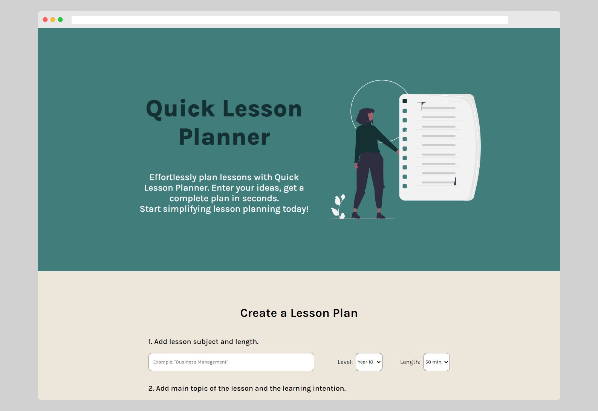

# Quick Lesson Planner 👨‍🏫

  

## [Live Site 🔗](https://quicklessonplanner.com/)

## Table of Contents

* [Description](#description)
* [Features](#features)
* [Technology](#technology)
* [How To Use](#how-to-use)

## Description 📝

Quick Lesson Planner is a web-based app that uses artificial intelligence to help teachers create lesson plans quickly and easily. With Quick Lesson Planner, teachers can save time and stress by letting the app handle the planning process.

## Features 🚀
- AI-assisted lesson planning using OpenAI's ChatGPT technology
- User-friendly interface
- Customizable to meet the needs of individual teachers
- Super simple to use without any sign up process

## Technology 👨‍💻
Quick Lesson Planner was developed using React, a JavaScript library for building user interfaces, and integrated with OpenAI's ChatGPT technology for natural language processing. This allowed for a seamless experience for users as they create lesson plans with the assistance of the app's AI capabilities.

## How to Use 💡
Using Quick Lesson Planner is easy. Simply start creating a new lesson plan using the easy-to-use form provided. The app will guide you through the process, suggesting resources and activities based on your input. You can add a few ideas or activities to get started, and Quick Lesson Planner will fill in the rest of the lesson with appropriate ideas. You can customize your lesson plans to fit your specific teaching style and curriculum requirements.

## Author 
[Jym Bocala](https://twitter.com/home)